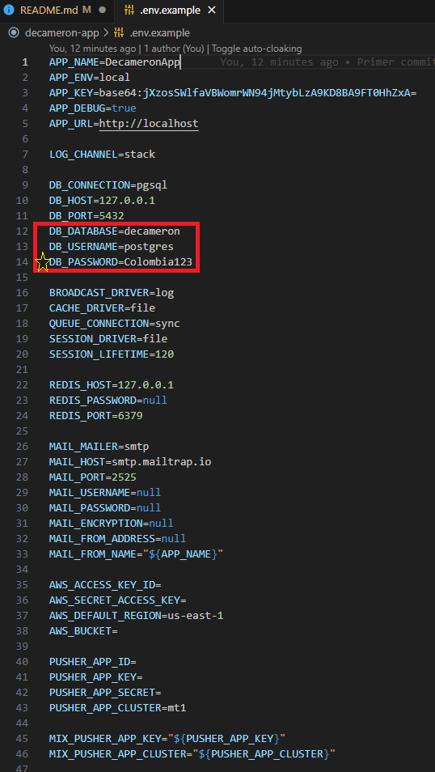
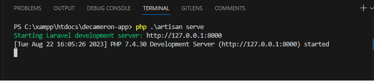
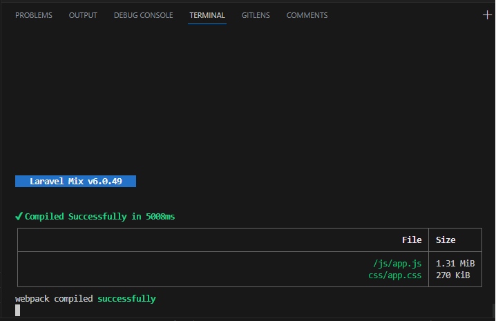
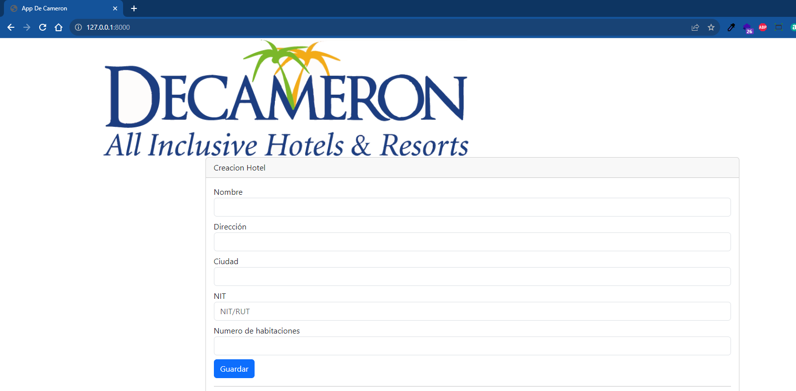

Prueba Técnica presentada por Luis Miguel Moya para IT BUSINESS & FINANCES.

Pasos para la el despliegue de la aplicación

1.Descargar XAMPP desde <a href="https://sourceforge.net/projects/xampp/files/XAMPP%20Windows/7.4.30/xampp-windows-x64-7.4.30-1-VC15-installer.exe/download">desde este link</a>

2.Instalar con <a href="https://www.wikihow.com/Install-XAMPP-for-Windows">esta guía</a>, una vez instalado abrir el "XAMPP Control Panel" y verificar que el servicio de Apache este en color verde

3.Habilitar la extension PDO de Postgre para PHP, clic en el boton Config y seleccionar PHP (php.ini), en el archivo buscar "extension=pdo_pgsql" y "extension=pgsql" y quitar ;

4.Descargar PostgreSQL de <a href="https://www.enterprisedb.com/postgresql-tutorial-resources-training-2?uuid=7b1a8f61-1469-4f8a-959e-e22e97e06691&campaignId=Product_Trial_PostgreSQL_15"> este enlace </a>

5.Instalar con <a href="https://www.postgresqltutorial.com/postgresql-getting-started/install-postgresql/"> esta guía </a>, una vez instalado abrimos el programa pgAdmin 4, conectamos con el servidor local y creamos la base de datos con el nombre de "decameron"

6.Descargamos Node JS desde <a href="https://nodejs.org/dist/v18.17.1/node-v18.17.1-x64.msi">este enlace</a>

7.Instalamos desde <a href="https://www.wikihow.com/Install-Node.Js-on-Windows">esta guía</a>

8.Descargamos el proyecto desde la parte superior o <a href="https://github.com/luismoya91/prueba_ITBF/archive/refs/heads/main.zip"> aquí </a>

9.Una vez descargado el proyecto copiamos la carpeta descomprimida en "C:\xampp\htdocs", ingresamos a la carpeta y creamos una copia del archivo .env.example en .env, cambiando la variable "DB_PASSWORD" por la contraseña que asigno en el paso 5

10.Ejecutamos el comando <italic> php .\artisan migrate </italic>, si es satisfactorio muestra un mensaje verde.

11.Ejecutamos el comando <italic> npm install </italic> y el comando <italic> npm run dev </italic>

12.Ejecutamos el comando <italic> php .\artisan serve </italic>

13.Ejecutamos el comando <italic> npm run watch </italic>

14.Ingresamos a http://127.0.0.1:8000/

Anexos

- Se agrega archivo "decameron.sql" con script de la creacion de la base de datos
- Se agrea archivo  "Prueba Decameron.postman_collection.json" con la collecion de endpoints del back-end para probar por postman
