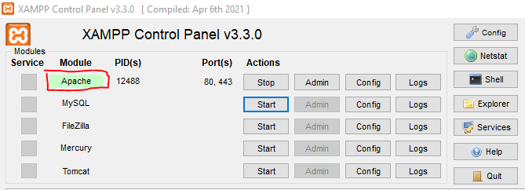
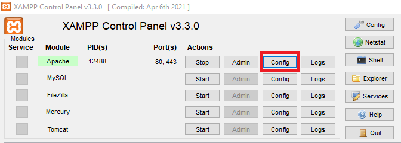
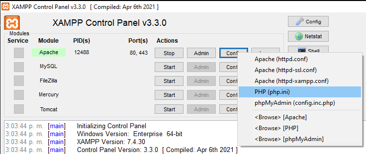
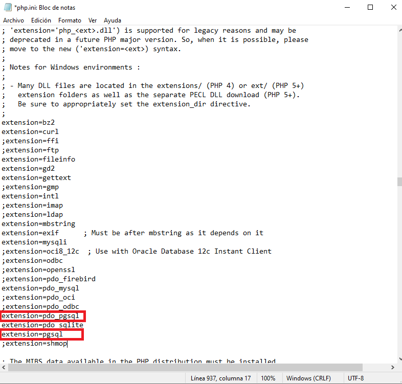
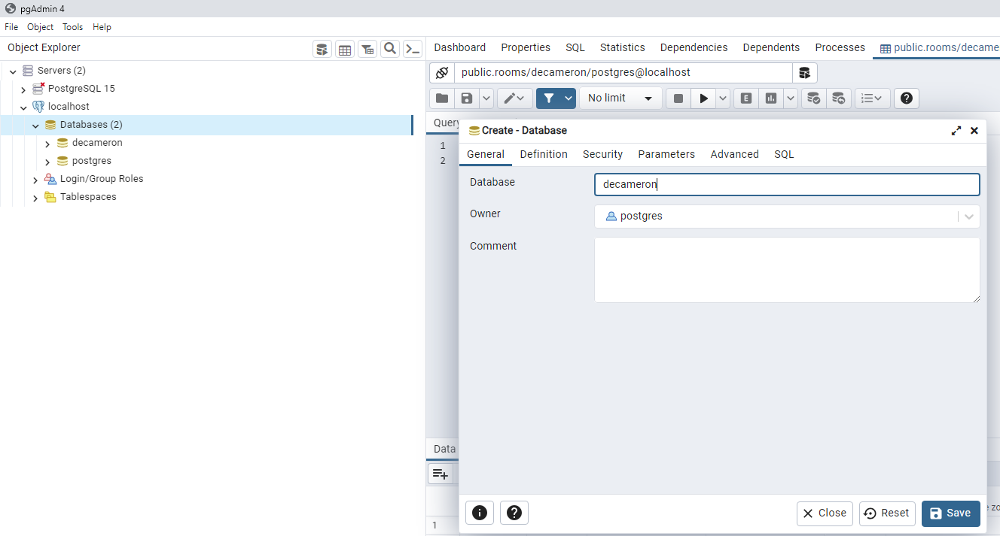

Prueba Técnica presentada por Luis Miguel Moya para IT BUSINESS & FINANCES.

Pasos para la el despliegue de la aplicación

1.Descargar XAMPP desde <a href="https://sourceforge.net/projects/xampp/files/XAMPP%20Windows/7.4.30/xampp-windows-x64-7.4.30-1-VC15-installer.exe/download">desde este link</a>

2.Instalar con <a href="https://www.wikihow.com/Install-XAMPP-for-Windows">esta guía</a>, una vez instalado abrir el "XAMPP Control Panel" y verificar que el servicio de Apache este en color verde

3.Habilitar la extension PDO de Postgre para PHP, clic en el boton Config y seleccionar PHP (php.ini), en el archivo buscar "extension=pdo_pgsql" y "extension=pgsql" y quitar ;

4.Descargar PostgreSQL de <a href="https://www.enterprisedb.com/postgresql-tutorial-resources-training-2?uuid=7b1a8f61-1469-4f8a-959e-e22e97e06691&campaignId=Product_Trial_PostgreSQL_15"> este enlace </a>

5.Instalar con <a href="https://www.postgresqltutorial.com/postgresql-getting-started/install-postgresql/"> esta guía </a>, una vez instalado abrimos el programa pgAdmin 4, conectamos con el servidor local y creamos la base de datos con el nombre de "decameron"

6.Descargamos Node JS desde <a href="https://nodejs.org/es/download">este enlace</a>

7.Instalamos desde <a href="https://www.wikihow.com/Install-Node.Js-on-Windows">esta guía</a>

8.Descargamos el proyecto desde

