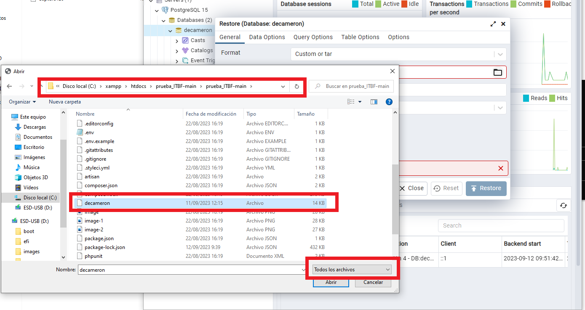
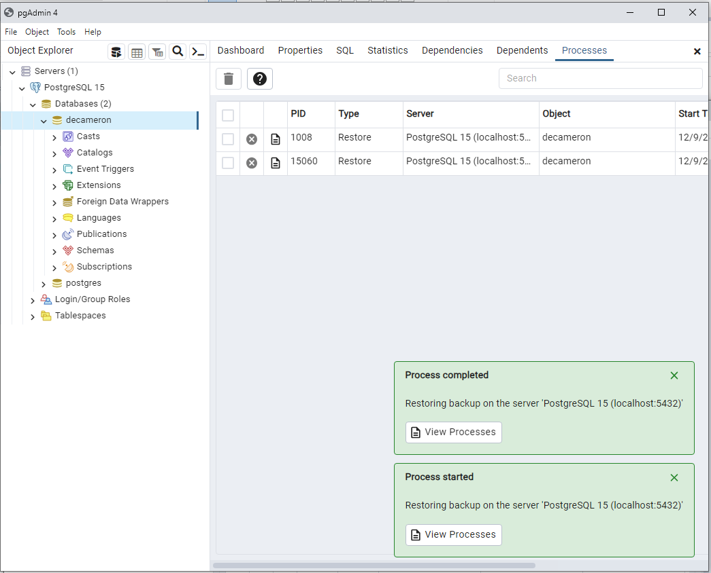
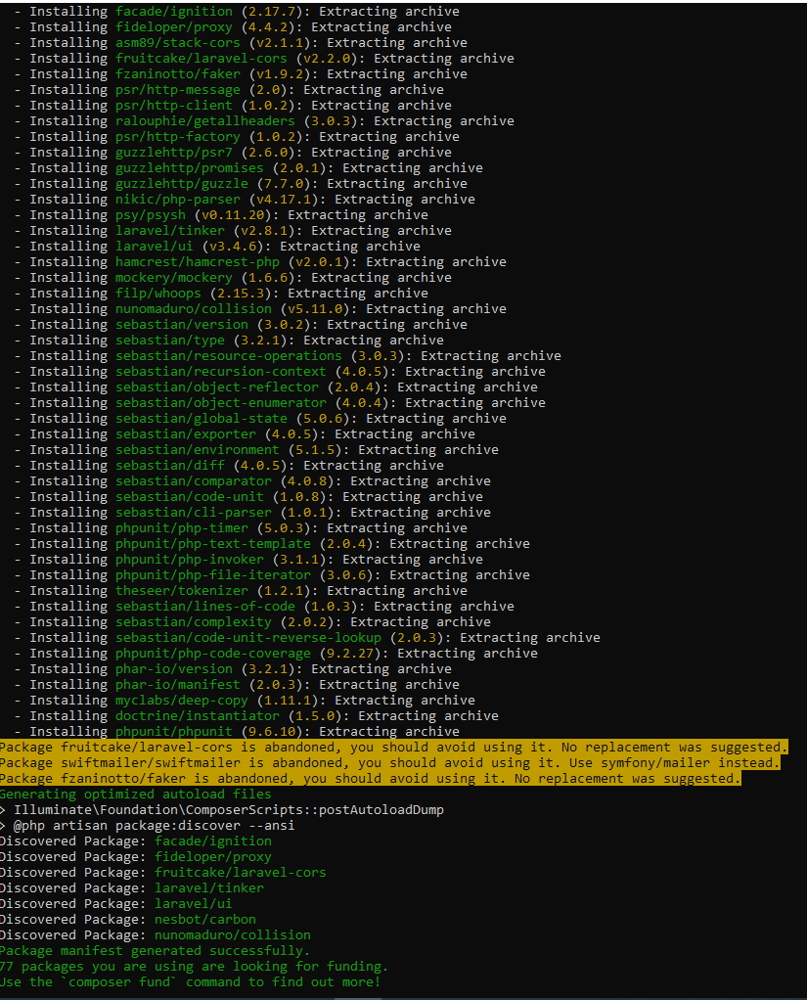
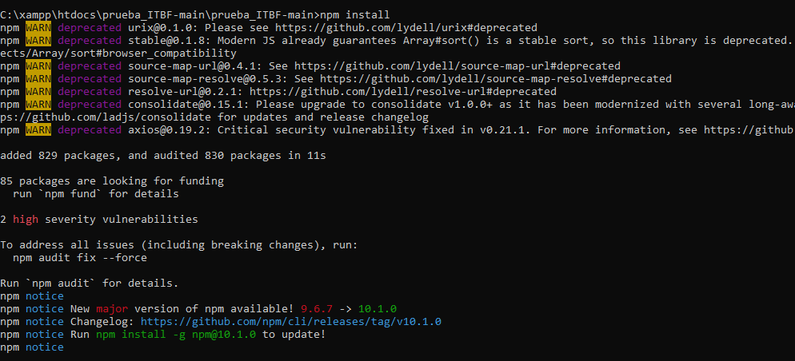

Prueba Técnica presentada por Luis Miguel Moya para IT BUSINESS & FINANCES.

Pasos para la el despliegue de la aplicación

1.Descargar XAMPP desde <a href="https://sourceforge.net/projects/xampp/files/XAMPP%20Windows/7.4.30/xampp-windows-x64-7.4.30-1-VC15-installer.exe/download">desde este link</a>

2.Instalar con <a href="https://www.wikihow.com/Install-XAMPP-for-Windows">esta guía</a>, una vez instalado abrir el "XAMPP Control Panel" y verificar que el servicio de Apache este en color verde

3.Habilitar la extension PDO de Postgre para PHP, clic en el boton Config y seleccionar PHP (php.ini), en el archivo buscar "extension=pdo_pgsql" y "extension=pgsql" y quitar ;

4.Descargar Composer de <a href="https://getcomposer.org/Composer-Setup.exe"> este enlace</a>

5.Instalar con <a href="https://norvicsoftware.com/que-es-y-como-instalar-composer-en-windows-10/#:~:text=Para%20instalar%20Composer%20en%20Windows,iniciara%20la%20instalaci%C3%B3n%20de%20Composer.">esta guía</a>.

6.Descargar PostgreSQL de <a href="https://www.enterprisedb.com/postgresql-tutorial-resources-training-2?uuid=7b1a8f61-1469-4f8a-959e-e22e97e06691&campaignId=Product_Trial_PostgreSQL_15"> este enlace </a>

7.Instalar con <a href="https://www.postgresqltutorial.com/postgresql-getting-started/install-postgresql/"> esta guía </a>, una vez instalado abrimos el programa pgAdmin 4, conectamos con el servidor local y creamos la base de datos con el nombre de "decameron" y reestablecemos la base con el archivo llamado "decameron"

8.Descargamos Node JS desde <a href="https://nodejs.org/dist/v18.17.1/node-v18.17.1-x64.msi">este enlace</a>

9.Instalamos desde <a href="https://www.wikihow.com/Install-Node.Js-on-Windows">esta guía</a>

10.Reiniciamos para que tome los cambios.

11.Descargamos el proyecto desde la parte superior o <a href="https://github.com/luismoya91/prueba_ITBF/archive/refs/heads/main.zip"> aquí </a>

12.Una vez descargado el proyecto copiamos la carpeta descomprimida en "C:\xampp\htdocs", ingresamos a la carpeta y creamos una copia del archivo .env.example en .env, cambiando la variable "DB_PASSWORD" por la contraseña que asigno en el paso 5

13.Abrimos la terminal, vamos a la direccion del proyecto, y ejecutamos los comandos:

a.  <italic> composer install </italic>

Si es satisfactorio muestra un mensaje verde. Si no se encuentra el comando "php", reiniciar el equipo.

b.  <italic> npm install </italic>

c.  <italic> npm run dev </italic>

d.  <italic> php .\artisan serve </italic>

17.Ingresamos a http://127.0.0.1:8000/

Anexos

- Se agrega archivo "decameron" con script de la creacion de la base de datos
- Se agrea archivo  "Prueba Decameron.postman_collection.json" con la collecion de endpoints del back-end para probar por postman
